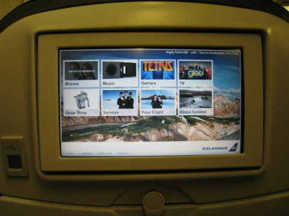

# アイスランドに行く 1日目

2011-09-18最終更新、2011-09-12作成

(→1日目、[2日目](20110913.md)、[3日目](20110914.md)、[4日目](20110914a.md)、[5日目](20110915.md)、[6日目](20110916.md)、[7日目](20110917.md))

いま、アイスランドにやってきています。初日は家を出てからホテルに着くまで27時間。いやー、長かった。何の役に立つかは分かりませんが、トピックスを思い出しながらメモしておきます。

## 成田スカイアクセス

成田空港へは日暮里から京成スカイライナーを利用しました。2010年7月に開通した京成成田空港線、通称「成田スカイアクセス」を利用してみたかったのが理由のひとつ。空港第2ビルまでノンストップで37分というのは、確かにいままでよりかなり速く感じます。各座席の足元には電源コンセントも用意されていました。乗ってる時間が短すぎて使う暇がないような気もしますが。

ただ、余裕を見て少し早く日暮里に着くと、その分待ち時間が増えるデメリットもあります。今まで成田に行くときは、たいてい京成の(ただの)特急を利用していました。これだと次に出る特急に乗ればいいだけなので、無駄な待ち時間はありません。また普通運賃だけなので安いですし、どちらがいいかは微妙なところです。実は今回スカイライナーを使ったもう一つの理由は、クレジットカードで代金を払ってカード付帯の旅行保険を効かせるため。これがなければただの特急にしていたかもしれません。

## スーツケースの受け取り

第2ターミナルに着いたら、まずは出発ロビーの一番北側にある宅配便コーナーに向かいます。2日前にQLライナーでスーツケースを送り出しておいたので、それを受け取ります。ここで往復の料金を支払い、帰りに自宅まで送る分の伝票ももらっておきました。

## チケットの受け取り

今回の旅行は添乗員なしツアーの形式のため、旅行会社の団体カウンターに行き、飛行機のチケットを受け取ります。チケットというと昔は細長い厚紙を冊子にしたものでしたが、最近はeチケットになっていて、受け取ったのはA4の紙をホッチキスどめした控えだけでした。

## 機械でチェックイン

本当は、JALのWebチェックイン(QuiC)で出発の72時間前からチェックインと座席指定が可能だったのですが、出発3日前の夜(受付開始から9時間後ぐらい)に試したところ、8割方の座席はすでに埋まっていて、残っている席もほとんどは3人がけの真ん中がポツンと空いているだけ、というひどい状況だったので、これは「やらない方がマシ」と考えて中断しました。そのため、空港に着いてから団体カウンターの近くにある機械でチェックインします。このときは、かろうじて窓側の隣り合った座席が1箇所だけ残っていたので、そこをキープしました(今回は2人連れです)。航空会社はJALですが、アメリカン航空のAAdvantageのマイル番号も機械で登録できました。

## 受託手荷物の預け入れ

JALのカウンターでスーツケースを預け、バゲージクレームタグを受け取ります。

## セキュリティーチェック

機内持ち込みのリュックと、100ml以下の液体を入れた透明袋と、PCとiPhoneと財布と鍵と腕時計をトレイに開けて、セキュリティーチェックを通ります。某国のように、靴を脱いだり体表まで見える機械を通されたりしないだけ、まだマシなほうでしょうか。

## 出国審査

審査といっても、パスポートと搭乗券を渡して出国スタンプを押してもらうだけ。

## CAFE & BAR AVIONでお茶

出発までまだ時間があったので、大きな窓から滑走路16Lの離着陸機が見えるCAFE & BAR AVIONで休憩。印刷しておいた空港チャートを見ながらワイドバンドレシーバーで航空無線を聴いたりして暇をつぶします。

## 搭乗

ロンドン・ヒースロー空港行きのJL401便に搭乗。機材はボーイング777、機体記号はJA735Jでした。

## 機内食1回目

離陸から1時間半ほどで1回目の機内食。味も良くてそれなりに量もあり、デザートにハーゲンダッツのバニラアイスクリームまで出ました。実は出発まで3週間ほどダイエットしていたので、こんなに食べたのは久しぶり。

## 機内エンタテイメント

とりあえず、映画の「岳 -ガク-」と「プリンセス トヨトミ」を見ました。でも飛行機で見る映画って、エンジンの騒音でセリフがよく聴こえない……。英語字幕が出てるので、それを見て意味をとりながら、……なんて本末転倒なことやってると、耳も目も頭もけっこう疲れます。

## 機内食2回目

離陸から約7時間後、アップルパイと飲み物のサービスがありました。

## 機内食3回目

夕食だか何食だかよく分からなくなってきてますが、離陸から約10時間後に出た3回目の機内食は、エアモスバーガー。テリヤキバーガーの作り方が配られ、自分でレタスをはさんでタレをかけてハンバーガーを作ります。さすがモスバーガー、味もグッド。

## ヒースロー到着

飛行機は定刻よりやや早くヒースローの近くへ。ところが、到着機が混み合っているのかホールディングパターンを3週ぐらいしたため、結局着いたのは定刻よりやや遅れでした。飛行時間は12時間以上でしたが、映画を2本観たりしたせいか、思ったより早く着いたような気がしました。

## 入国か乗り継ぎか、それが問題だ

旅行会社の事前説明では、ヒースローについたら受託手荷物を一旦受け取って、乗り継ぎ便のアイスランド航空のカウンターで預け直すように指示がありました。また、JAL便はターミナル3に着くので、Flight Connectionsという表示に従ってバスでターミナル1の乗継センター(Flight Connections Centre)に移動してチェックインするように、とも指示があり、イギリスでの入国審査は無いとのことでした。ところが、実際ヒースローのターミナル3に到着してみると、バゲージクレームは入国審査の「あと」になっていて、受託手荷物を受け取るには必ず入国が必要となります。逆に、乗継センターに向かえば確かに入国審査はありませんが、こんどは受託手荷物の受け取りができません。さて困った、どちらの指示に従うべきか……。係員に聞いてみても、荷物を受け取るなら入国審査の列に並ぶように、としか言ってくれません(まあ当然です)。最悪なのは、乗継センターに向かって体だけ乗り継いだものの、受託手荷物はバゲージクレームに置き去り、というパターンなので、ここは無駄足になっても一旦入国して荷物が出てきているかどうか確認することにしました。とは言うもの、入国審査の列の長さは尋常ではなく、優に1時間以上はかかりそうです。

でもこうなったら仕方ありません。長い長い列に並んで、入国審査官にも「トランジットだけど荷物を取らなきゃいけないので」と説明して審査を通過、ようやくバゲージクレームに向かいます。そこで、JALの荷物を扱っている係員にバゲージクレームタグを見せると――、「あ、これはケプラヴィーク(到着地の空港)で出てくるから、ここでは出てこないよ」とあっさり言われてしまいました。やはり無駄足。思えば最初に成田で荷物を預けたとき、ヒースローでピックアップする必要があるのかどうか、はっきり確認しておくべきでした。がっくり。

しかし。しかしまあ、イギリスの入国スタンプも初めてゲットできたことだし、せっかく入国したんだからその辺ちょっと見てから行くか、と前向きに考えて前に進みます。地下道を通ってターミナル1に移り、アイスランド航空のカウンターを見つけてチェックインし、こんどは出国手続きとセキュリティーチェックをもう一回やって、ようやく一段落です。

## アイスランド航空

とトラブルでかなり時間を食ったものの、もともと5時間近く乗継時間があったので、ヒースローからケプラヴィークに向かうアイスランド航空FI455便の搭乗までにはかなり時間があります。まだ搭乗ゲートも決まってません。ターミナル内をあちこち見て回って、飲み物とサンドイッチで腹ごしらえをして、ようやく掲示板にゲート番号が表示されたのは出発予定時刻の45分ぐらい前。すぐにゲートに向かいますが、準備が整わずなかなか乗せてくれません。10分押しぐらいでプッシュバックした後も、離陸までにはさらに30分ぐらいかかりました。ケプラヴィークまでの飛行時間は約2時間半。外は真っ暗だし、日本の早朝にあたる時間だしで、ほとんど寝ていたため、ミールサービスがあったのかどうかもわかりません。機材はボーイング757、機体記号は確認できませんでした。座席の液晶画面がわりと大きく、しかもタッチパネルだったのが印象的です。

## ついにアイスランドへ

そして長旅の末、ようやくアイスランドに到着。気温は摂氏8度、空は快晴です。まずは入国審査ですが、ゲートは2つしかなく、なんとも小ぢんまりとしています。

ここを抜けてから、バスで別ターミナルに移動し、受託手荷物の受け取りとなりました。前述の通りヒースローで預け替えを行っていないので一抹の不安はありましたが、無事に出てきてホッとします。税関を抜けて到着ロビーに出ると、右手にあるflybusのブースで日程表を見せ、ホテルまでのバスのチケットと、帰りのバスチケットを受け取ります。

ATMで現地通貨を少々引き出したりしていると、外にバスが到着。運転手にチケットを渡し、行き先のホテルを告げて乗り込みます。飛行機の到着から40分後ぐらいにバスは発車。レイキャビク市街に向かいます

## オーロラ

時刻は現地時間で深夜0時過ぎ。北極圏に近いレイキャビクとは言え、さすがにこの時期この時間ではあたりは真っ暗で、これだけ暗ければオーロラが出たら見えそう、と思っていた矢先、バスの窓からなんとなく薄い雲のようなものが……。あまり動きがなく、最初白っぽく見えたので雲だろうと思ったのですが、しばらく見ていると全天に広がる緑色のベールに変わっていきました。これは間違いなくオーロラです。星も透けて見えています。時期的にも地理的にもオーロラは全然期待していなかっただけに、これは思わぬご褒美でした。

## ホテルに到着

バスでアナウンスがあり、いくつかのホテルの人は別のバスに乗り換えるよう指示があります。バスがたくさん停まっているBSÍバスターミナルで一旦停車し、乗り換える人たちを降ろして再出発、今回の宿泊先であるフォスホテル・リント(Fosshótel Lind)の前で停車したところでバスを降ります。

すでに門限を過ぎていたため正面入口は閉まっていましたが、呼び出しボタンを押すと、夜勤らしい穏やかな男性が出てきて手続きをしてくれました。その方は日本に2ヶ月ほど滞在したことがあって、西日本から沖縄を自転車で回ったそうです。このホテルでは無線インターネット接続が有料だったのですが、1日分おまけしてくれました。そしてたどりついた部屋はこんな感じ。質素ですが、まあ必要十分という感じの部屋です。

という感じの27時間。気が向いたら続きも書きます。

(→1日目、[2日目](20110913.md)、[3日目](20110914.md)、[4日目](20110914a.md)、[5日目](20110915.md)、[6日目](20110916.md)、[7日目](20110917.md))

※更新履歴

- 2011-09-17 機体記号を修正
- 2011-09-18 表現を修正
