# アイスランドに行く 2日目

2011-09-18最終更新、2011-09-13作成

(→[1日目](20110912.md)、2日目、[3日目](20110914.md)、[4日目](20110914a.md)、[5日目](20110915.md)、[6日目](20110916.md)、[7日目](20110917.md))

## 朝食

レイキャビク市内のホテル、フォスホテル・リントで最初の朝を迎えました。

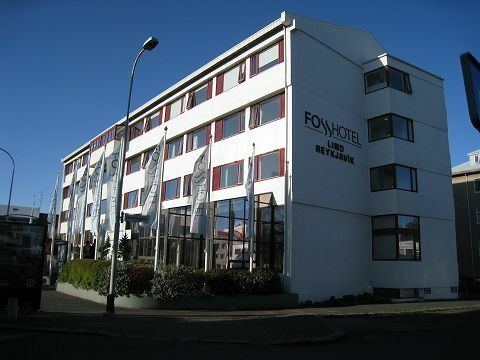

朝食は、地下1階の食堂でビュッフェ方式。時間は7時から10時までです。

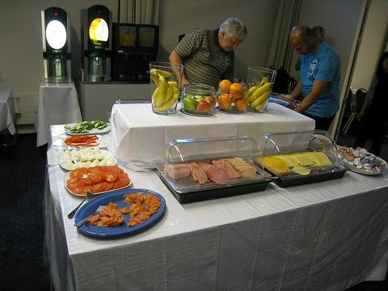

## ブルーラグーン

今日は、世界最大の露天風呂、ブルーラグーン(Blue Lagoon)に行きます。9:30にホテルのロビーで待っていると、現地ツアー会社のバスがピックアップにやってくるのでそれに乗り、BSÍバスターミナルでブルーラグーン行きの大きなバスに乗り換えます。このとき、帰りのバスのチケットを渡されました。

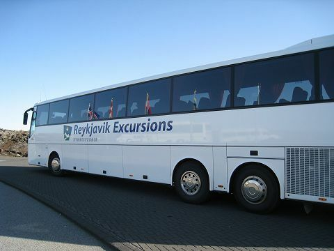

道中は、比較的若い溶岩でできた荒涼とした大地が続きます。遠くで地面から吹き上がる蒸気のようなものが見え始め、なんだろうと思っていると、それがブルーラグーンにお湯を供給しているスヴァルスエインキ(Svartsengi)地熱発電所でした。

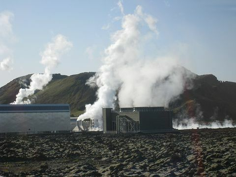

駐車場から施設入口まで、溶岩の中に作られた小径を進みます。

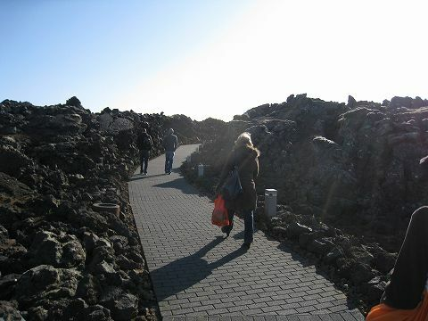

受付で入浴料として1人4,800アイスランドクローナ(ISK)を払うと、青いブレスレットを渡されます。

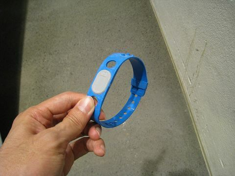

白い部分にICチップが入っていて、これをラグーン入り口の改札機の青いセンサーにかざすと緑の矢印が点灯するので、バーを押して前に進みます。靴を脱いで更衣室に入り、空いているロッカーを探して水着に着替えます。ロッカーは、扉を閉じると番号表示窓がしばらく点滅するので、その間に青いセンサーにブレスレットをかざすと鍵がかかります。もう一度かざすと、ロックが解除されます。バスタオルをタオル置き場に置いて、シャワー室で体を洗うと、いよいよブルーラグーンへ。

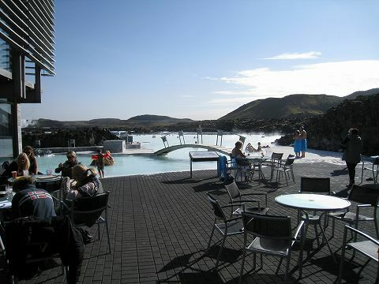

ちなみにこのブレスレットは施設内で飲食するときにも使えます。ラグーンサイド(?)で飲み物などを売っているコーナーがありました。料金は最後に精算するようですが、今回この機能は使いませんでした。お湯から上がったら、シャワーを浴びて体を拭き、更衣室で着替えて出口の改札機を抜けます。この改札機は、青いセンサーにブレスレットをかざすとフタが開いてブレスレットを返却するようになっています。

そのあとラーヴァレストラン(Lava Restaurant)で昼食。ランチ・ビュッフェが3,500 ISKでした。

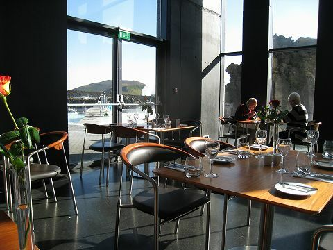

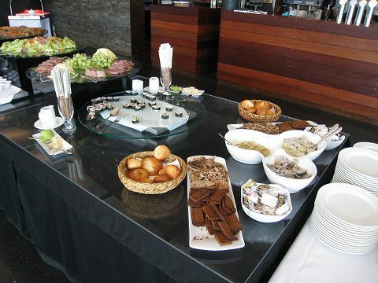

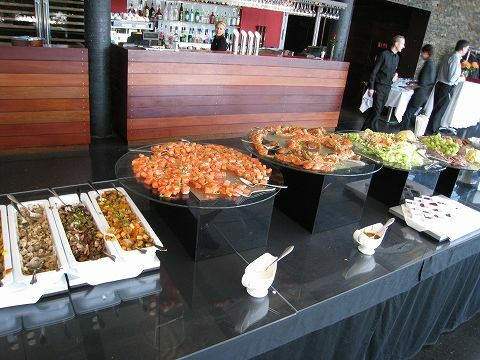

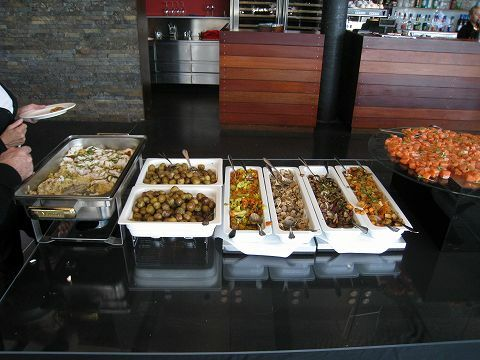

レイキャビクに戻るバスはだいたい毎時15分に出ています。都合の良い便を選び、チケットを渡してホテルの名前を告げて乗り込むと、ホテルの近くでドロップしてくれます。

## 買い出し

午後も早い時間に帰ってきたので、ミネラルウォーターなどを買おうと思い、レイキャビクいちの目抜き通りロイガヴェーグル(Laugavegur)に行ってみます。ところが今日は日曜日。ほとんどの店は閉まっています。日本ではちょっと考えられない光景です。Bakarí Sandholtというパン屋のようなケーキ屋のような店でパンを買いました。買わなかったけど、iPhone型のチョコレートのようなものを売っていました。

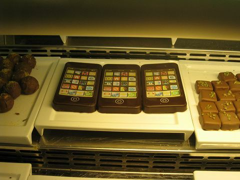

豚のマークのBónusというスーパーマーケットで水やお菓子を買ったところ、水は炭酸入りでした。アイスランド語の表記しかないと、炭酸入りかどうか見かけでは判断できません。(ちなみに、帰国時のアイスランド航空で機内のメニューをみると、普通の水はvatn、炭酸水はkolsýrt vatnと書いてありました。)

## オーロラツアー

昨日見事なオーロラが出たため、Northan Lights Misteryというツアーが急遽企画されたとのことだったので、申し込んでみました。ホテルのフロントで1人4,900 ISKを払い、バウチャーを受け取ります。19:30にホテルでピックアップ。Iceland ExcursionsのSales Officeというところで下ろされ、オフィスでバウチャーをチケットに交換してもらいます。近くに停まっていた大型バスに乗り込み、軽快なトークのガイドに連れられて向かった先は、シンクヴェトリル(Þingvellir)国立公園。かなりの寒さで、ダウンを着てもまだ寒いぐらいです。今日はNASAのオーロラ予報がレベル4(レベルは0から9まであって、昨日もレベル4だったとか)で、しかも真上に出そうなのでとても期待できる、という話だったのですが、残念ながら途中から雲が増えてきて、確かに薄雲を通して緑色のオーロラが出ているのはわかったのですが、昨日ほど見事なものは見られませんでした。国立公園を後にしたのは23:20頃。そんな時間でも、西の空が完全に暗くはなっておらず、山並みのシルエットが見えていたことに驚きました。

(→[1日目](20110912.md)、2日目、[3日目](20110914.md)、[4日目](20110914a.md)、[5日目](20110915.md)、[6日目](20110916.md)、[7日目](20110917.md))

※更新履歴

- 2011-09-18 表現を修正
