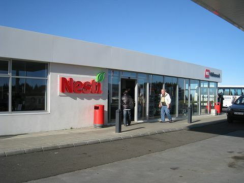
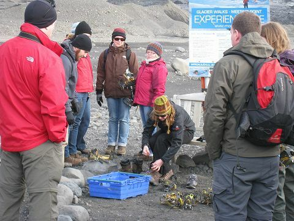

# アイスランドに行く 4日目

2011-09-18最終更新、2011-09-14作成

(→[1日目](20110912.md)、[2日目](20110913.md)、[3日目](20110914.md)、4日目、[5日目](20110915.md)、[6日目](20110916.md)、[7日目](20110917.md))

## 朝食

ホテルでの朝食も3回目。毎日メニューは同じです。

## 南海岸探検ツアー

今日は島の南西部をまわるバスツアー「南海岸探検ツアー」(South Shore Adventure)に参加します。いつものように、ホテルの前までピックアップのバスが来てくれます。

BSÍバスターミナルで大きなバスに乗り換え。今回は座席に余裕があります。

車窓からは、いたるところで馬や羊が放牧されているのが見えます。1時間半ほど走ったところにあるセルフォス(Selfoss)という街のガソリンスタンドでトイレ休憩。修学旅行か何かなのか、50人ぐらいの高校生の集団が居ました。

## ミールダールスヨークトル

あとで寄ることになる滝を左に見ながら通り過ぎ、最初はミールダールスヨークトル(Mýrdalsjökull)という氷河に向かいます。ヨークトル(jökull)はアイスランド語で氷河の意味です。2010年に噴火してヨーロッパの航空便を麻痺させたエイヤフィヤトラヨークトル(Eyjafjallajökull)のすぐ隣にあり、その火山灰で氷河の表面が黒く汚れています。幹線道路から氷河付近までの15分ほどは、小さな川を乗り越えたりして、相当な悪路を走ります。氷河が溶けた水でできた川がしょっちゅう道を飲み込んでしまい、ルートが変わるそうです。バスを降りると気温はかなり低く、たぶん5度ぐらい。

そこから10分ぐらい歩くと、氷河に触れるほどの距離まで接近できます。氷河から水が滴っていたり、小さな氷の塊が川に流れている様子が見られます。

特別な装備をつけてここから氷河トレッキングに出るグループもいるようです。

## ブラックサンドビーチ

次は真っ黒な砂浜、ブラックサンドビーチ(Black Sand Beach)。唸りを上げて打ち寄せる大波、塔のように聳える奇岩、柱状の岩が並ぶ山肌、飛行機が通り抜けたこともあるという大穴のあいた岬、上を見上げると悠然と飛ぶ鳥たちと、360度どこを見ても非日常の景色が広がる不思議な空間です。

## 昼食休憩

ヴィーク(Vík)という小さな町で昼食。ガソリンスタンド兼雑貨屋兼カフェテリアのようなところでエッグバーガー(1,045 ISK)とフィッシュアンドチップス(1,790 ISK)。意外にも、というと失礼ですが、とても味が良かったです。

そのあとは隣のウール製品工場兼販売所でウインドウショッピング。

## スコゥガル博物館

ここからは来た道を引き返し、スコゥガル(Skógar)という小さな町にあるスコゥガル博物館(Skógasafn)を1時間ほど見学。最初の30分は、学芸員のような小柄な女性が民俗資料の説明をしてくれます。フランス人だそうですが、ものすごく綺麗な英語を話します。完璧なアイスランド語も話せるそうなのに、ここに来てまだ2年なのだとか。資料は12,000点もあるそうで、正直いってこんな田舎になぜこんな立派な博物館が? というぐらいにすごいところです。

## スコゥガフォス

博物館からすぐの距離にあるスコゥガフォス(Skógafoss)という滝に向かいます。落差60m、幅25mの見事な滝に二重の虹がかかって見えます。隣の山では、そんな絶景にお構いなく、あちこちで羊が草を食べています。

## セーリャラントスフォス

最後はセーリャラントスフォス(Seljalandsfoss)。スコゥガフォスよりは小さな滝ですが、ここは歩いて滝の裏に回ることができます。どこかの滝のように裏に穴を掘っているのではなく、自然の地形で裏に回りこめるようになっているのです。その迫力はスコゥガフォスに引けをとりません。

セーリャラントスフォスを後にすると、ノンストップで2時間ほどかけてレイキャビクに戻ってきます。今回の男性ガイドは、相当なアイスランド語訛りの英語でよく聞き取れないところもたくさんあったのですが、アイスランドの歴史や経済危機などのシリアスな話にいろんなユーモアを絡めて話す面白い人で、かなり楽しめました。

## JAL便のWebチェックイン

帰りのJAL便の出発72時間前を過ぎたので、ふたたびJALのWebチェックイン(QuiC)を試してみます。行きのJL401便ではまともな席が残っていませんでしたが、帰りのJL402便では、逆に好きな座席を指定し放題という感じでした。さすがに旅行先から利用する人は少ないのかもしれません。オンライン搭乗券の「発行」ボタンを押してプリンタで印刷しろという指示がでますが、当然ながらプリンタは持っていないのでそのままにしました。

## 3 Frakkarで夕食

今日の夕食はアイスランド的なシーフードをということで、フロントのお兄さんに教えてもらった3 Frakkar(Þrír Frakkar, Baldursgata 14, 101 Reykjavík)というレストランに行きました。

野菜コンソメスープ(Grænmetis-Kjötseyði)、1,090 ISK。コクがあっておいしいですが、味がやや濃すぎ。

スモークハドックのクリームソースがけ 野菜のガーリック炒め添え(Rjómasoðnir reyktir Ýsustrimlar með hvítlauksristuðu grænmeti)、3,350 ISK。塩加減間違った? というぐらい塩辛い。

オヒョウのフィレのバターフライとロブスターソースのロブスター(Smjörsteikt Lúðuflök með Humar og Humarsósu)、4,390 ISK。オヒョウの身がやわらかく、ロブスター味が濃厚なソースも美味。

バニラアイスクリームのチョコレートソースがけ(Vanilluís með súkkulaðisósu)、1,190 ISK。

カフェラテ(Kaffi latte)、450 ISK。

店員の愛想がいまいちで、ちょっと残念な感じでした。

(→[1日目](20110912.md)、[2日目](20110913.md)、[3日目](20110914.md)、4日目、[5日目](20110915.md)、[6日目](20110916.md)、[7日目](20110917.md))

※更新履歴

- 2011-09-17 JAL便のWebチェックインを追記
- 2011-09-18 表現を修正
