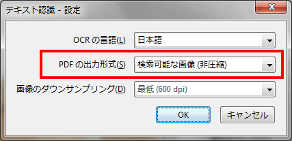

# Acrobatで傾き補正なしでOCRをかける

2012-06-16作成

以前、自炊したPDFの解像度を第3世代iPadに最適化しつつ、OCRで透明テキストを付ける方法がないものか、という話を書きましたが(「[自炊PDFの解像度最適化とOCRが両立しない](20120408.md)」)、これの解決方法は、実は目の前に転がっていました。

Adobe Acrobat 9でOCRテキスト認識するときのオプションに「PDFの出力形式」というのがありますが、ここを「検索可能な画像**(非圧縮)**」にしておけば、もとの画像が忠実に保持された上で、透明テキストがかぶせられるようになります。私の不満は、第3世代iPad用に解像度を落とした画像に傾き補正がかかると文字のクッキリ感が薄れることだったので、元画像が保持されれば何の文句もありません。

なお、最終結果としての画像はオリジナルがそのまま使われますが、OCRをかける途中で内部的には傾き補正をかけているようです。文字が横に寝たページの場合、ページの回転は実施されて、文字が起きた状態になります。

OCRの精度は、300dpiの元画像にかけるより多少落ちるのかもしれませんが、もともとOCRにそれほど期待はしていなくて「無いよりマシ」程度に考えているので、個人的にはこれで十分です。

※バージョンメモ

- Adobe Acrobat 9 Standard 9.5.1
