# ClearScanを試す その1

2012-09-02作成

(→その1、[その2](20120909.md)、[その3](20120916.md))

AcrobatのOCRテキスト認識には、ClearScanという機能があります。元画像に透明テキストを重ねるのは普通のOCRと同じですが、その際、文字から自動的にアウトラインフォントを作り出し、文字に見える画像は消して、そのフォントに置き換えてしまうところが普通とちょっと違います。同じように見える文字は統合して1つにまとめてくれるので、すべて画像の世界に比べると、いかにもファイルサイズが小さくなりそうな感じがします。ただし、そういう置き換えをやる以上、見かけが多少オリジナルと変わってしまうのはやむを得ません。私は、紙の本をなるべく忠実に電子化するのが好みなので、いままでClearScanには手を出さずに来ました。でも自炊した本の数が増えるにつれて、持ち歩くときのファイルサイズが問題になってきています。食わず嫌いも良くないということで、少し試してみました。

手始めに、新書を1冊ClearScanにかけてみます。元ファイルは、ScanSnap S1500のスーパーファイン/カラー/圧縮率3でスキャンした300dpiのPDFで、ジャケットなんかも含めたPDF上のページ数は257ページ、ファイルサイズは46MBです。これを、「OCRの言語=日本語、PDFの出力形式=ClearScan、画像のダウンサンプリング=最低(600dpi)」でOCRテキスト認識させます。

かかった時間は12分。ClearScanはとても時間がかかるという話も聞いていましたが、今回の例ではそうでもないようです。ファイルサイズは9MBと、劇的に小さくなりました。なお、比較のため「PDFの出力形式=検索可能な画像」で普通のOCRもかけてみましたが、この場合は10分かかって35MBのファイルができました。AcrobatはOCRの際に傾き補正をしてわりと高めの圧縮率で画像を保存し直すので、普通にOCRをかけるだけでも結構ファイルサイズが減ります。

- オリジナル: 46MB
- 普通のOCR: 35MB(76%) 処理10分
- ClearScan: 9MB(20%) 処理12分

ファイルを開いてページを全体表示させた印象は、オリジナルとそんなに変わりません。文字の質感はどうでしょうか。オリジナルはこんな感じですが――、

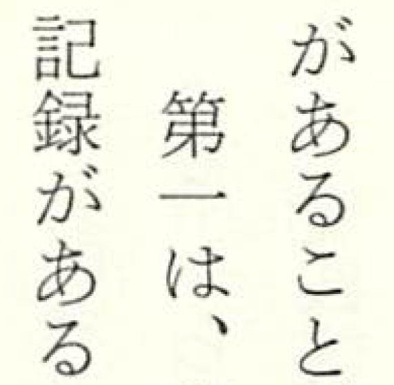

ClearScanだとこうなります。線の強弱が、コピー機で3回ぐらいコピーしたあとのような感じに見えますが、それほど読みにくくはありません。

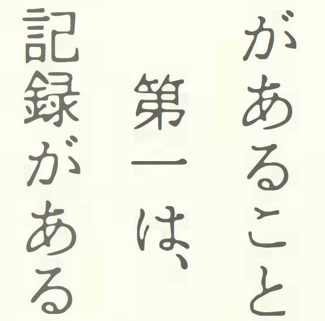

そういえば、ClearScanするときは、元画像がカラーやグレースケールより白黒の方がよいという話も聞くので、ちょっと脱線しますが、試しに1ページだけImageMagickのconvert -monochromeで白黒に変換した上でClearScanしてみました。その結果がこれです。確かに色は濃くなったけど、個人的にはどっちもどっちという気がします。白黒にするのなら、最初のスキャンの段階から白黒600dpiとかにしておかないと、あまり効果はないのかも。あと、上の結果では2箇所に登場する文字(「が」「あ」「る」)がまったく同じ形をしていて統合されているように見えますが、白黒の場合は明らかに別の形をしていて、うまく統合されていないようです。

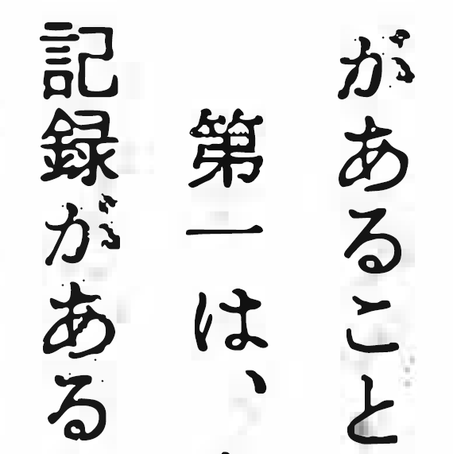

さて、話を元のClearScanに戻して……。ところどころ、フォントの置き換えが失敗して、画像のまま残っている箇所もあります。ただし、画像で残っている部分もOCRはちゃんとかかっていて、正しい透明テキストがかぶさっています。

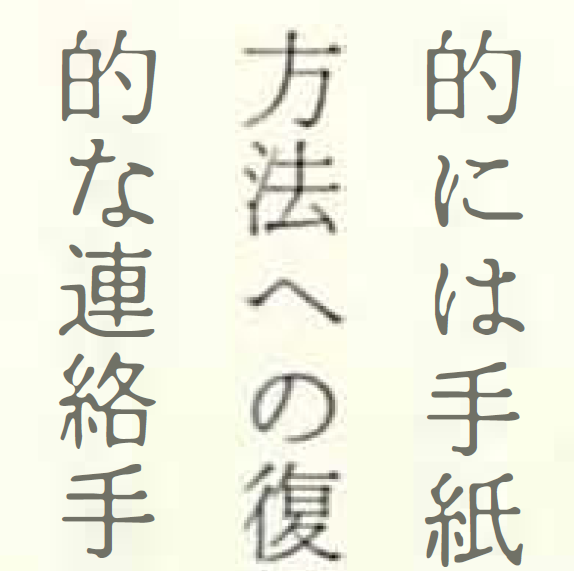

どういうわけか、オリジナルではなんでもない「保」という文字が――、

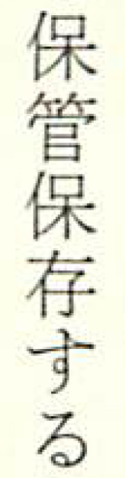

ClearScanで自動生成されたフォントでは一部塗りつぶされています。これは他の文字でも何箇所か発生していました。

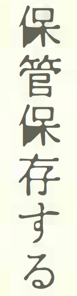

ルビは、画像のままになっているところもあれば――、

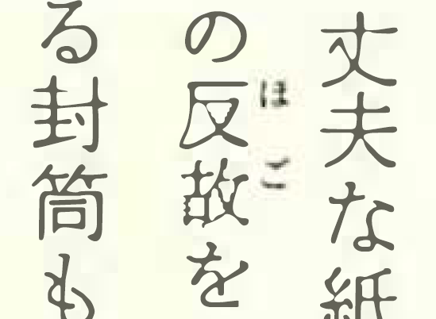

フォントに置き換わっているところもあります。

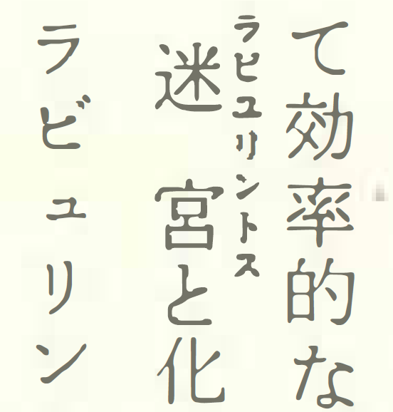

また、一部で文字送りが破綻してしまっているところがあります。オリジナルではこうだったのが――、

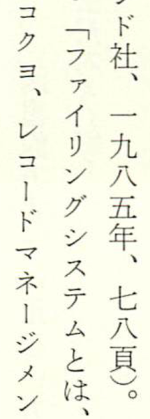

ClearScan版ではなんだかぐちゃぐちゃ。「シ」と「ス」は完全に順序が入れ替わっているので、これだけみるとオリジナルに誤植があったと勘違いしてしまいそうです。ここまでひどいケースは珍しいですが、ちょっと間隔がおかしいなという場所はどのページにもある感じです。

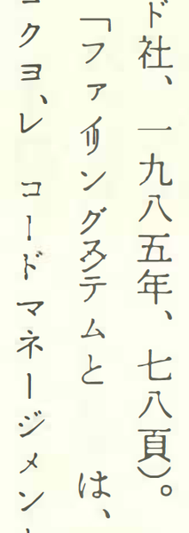

次の箇所は、透明テキストの方が「一定期聞は」になっていて、「間」が「聞」に誤認識されているのですが、フォントの方は正しく「間」と読めます。

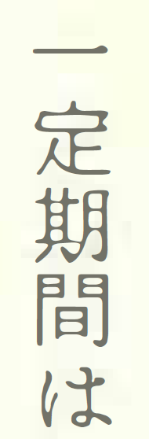

図や絵は原則画像のままで、一部がフォントに置き換わったりするようです。

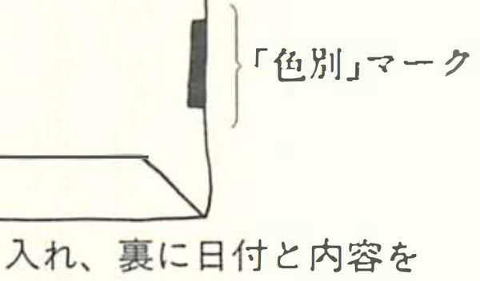

聞いた話では、「同じように見えるけど本当は微妙に違う文字」が1つに統合されてしまって、結果的に誤字になってしまうこともあるようですが、今回パラパラと確認した範囲では、そういうケースは見つけられませんでした。

このファイルをiPadでも表示させてみましたが、そんなに違和感はありません。読む分にはほとんど支障なさそうです。画面描画にかかる時間を調べるため、i文庫HDの見開き表示で最初から最後まで早送りボタンでスクロールしてみると、1分22秒かかりました。解像度をiPadに最適化したファイルだと35秒なので、それよりはやや遅いですが、実用範囲内です。

というわけで、今回のサンプルだと、普通のOCRと比較したときのメリット・デメリットはこんな感じでしょうか。

- ○ファイルサイズが5分の1まで小さくなる
- ×文字の一部が塗りつぶされる場合あり
- ×文字送りがおかしくなる場合あり

(→その1、[その2](20120909.md)、[その3](20120916.md))

※バージョンメモ

- Adobe Acrobat 9 Standard 9.5.2
- ImageMagick-6.7.8.6
