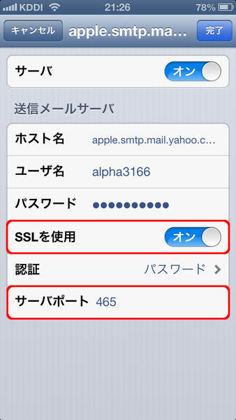

# iOSでYahoo!メールのSMTPを暗号化する

2012-10-28作成

Yahoo! JAPANのメールは、iPhoneやiPadの「プッシュ」に対応していて、メールが届いたらリアルタイムで通知してくれるので、とても便利ですよね。

ところで、Yahoo!メールはPOP、IMAP、SMTPの全てでSSLによる暗号化通信に対応しているのですが、iOSの標準メールでアカウントを設定すると、初期値ではSMTPのSSLが無効になっているようです。Yahoo!メールのSMTP AuthはCRAM-MD5ではないので、このままではメール送信のときにパスワードが平文で流れてしまい、危険です。ここは手動で「SSLを使う」にしておいた方が良いでしょう。その際、ポート番号を587から465に変える必要があります。

具体的には「設定」→「メール/連絡先/カレンダー」→ Yahoo!のアカウント →「アカウント」→「SMTP」→「プライマリサーバ」の順にタッチして(深い!)、「SSLを使用」を「オン」に、またサーバポートを「465」にして「完了」を押します。

しかし、IMAPはちゃんとSSLを使用するようになっているのに、なんでSMTPもそうしないのか、ちょっと謎ですねえ。

※バージョンメモ

- iOS 6.0
