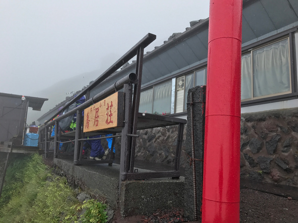
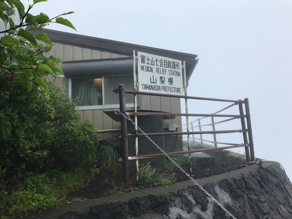
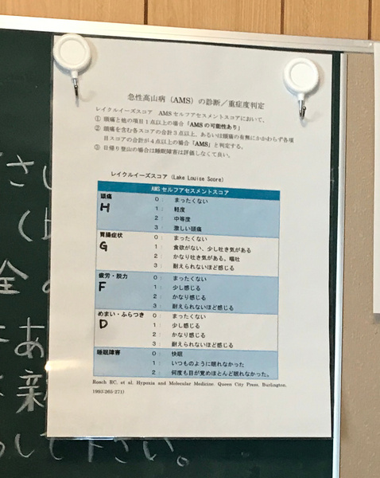

# 富士山で過呼吸になった話

2017-07-27作成

## 突然苦しくなり筋肉が硬直

富士山の吉田ルート七合目にある鳥居荘(標高2900m)のベンチで休憩していたときのこと。ただ座っているだけなのに、急に両腕がジンジンと痺れだした。なんだこれは? と不安に駆られていると、1分ぐらいで胸の周りまで重く痺れたように苦しくなってきた。これはさすがにおかしいと思い、同行者に「急に手と胸が苦しくなってきた!」と言ったものの、呂律が回らない。舌がうまく動かず、調音点まで舌が届かないような感じだ。ただ意識ははっきりしていて、高山病? それとも何かの脳機能障害? みたいなことを考えている。深呼吸を繰り返していると、両手の指が硬直して動かせなくなってきた。同行者が山小屋の人を呼んでくれて、こりゃ高山病だよ、深呼吸して、指を動かして、というのでさらに深く息を吸って吐いてを繰り返すものの、指の硬直はどんどん酷くなる。とりあえず山小屋に入れてもらい上がり口に腰掛けるが、太もものあたりも痺れてきて、歩くのもやっと。山小屋の人が、こりゃ高山病だよ、休んでる時でよかった、歩いてる時だったら倒れて死んでたよ、服も濡れてるじゃない、こりゃ低体温症だ、というようなことを言い、毛布で温めてくれて、お湯を何口か飲ませてくれた。でもあまり症状は変わらない。むしろ深呼吸を繰り返しているうちに顔面が硬直してきて、目もしっかり開けていられなくなってきた。同行者の2人が一生懸命指を揉んでくれるが、効果があるのかも分からない。

## 山を下って七合目救護所へ

感覚的に、しゃべっている方が楽になるというのが分かってきたので、回らない口でとにかく何か喋るようにする。そうしていると、ほんの少しだけ手の硬直が緩んできた。高山病なら下山するしかないので、少しでも体が動くうちに下山を始めることにする。寒さは感じていなかったが、手持ちのダウンやグローブを全て着せてもらい、同行者1人に付き添ってもらって3つ下の七合目救護所を目指す。少し下っただけで、症状が大分おさまってきた。七合目のこの辺りは岩場が続くので下りられるか不安だったが、これなら少しずつでも進めそうだ。1つ下の富士一館に着く頃には、舌や指の硬直はほぼおさまっていた。ここは登り専用の登山道で、登ってくる人が途切れることなく続いているのでなかなか先に進めない中、ようやく七合目救護所にたどり着いた。このころには各所の痺れもほぼ取れていた。

## 痺れが出るのは「過呼吸」

救護所の呼び鈴を押して出てきたドクターに症状を説明すると、すぐにそれは過呼吸だと言われる。過呼吸! 何と!! 実は、登りを開始してからずっと、高山病予防のために鼻で深く息を吸って口をすぼめて吐く深呼吸を繰り返していた。症状が出る前の岩場では、上を見上げるとあたまが少しふらつくようになっていて、果たしてこれは高山病の前触れなのか、まさか過呼吸だったりしないよね? と自分で考えていたのだ。だけど、過呼吸でこんな強烈な症状が出るとは思ってもみなかったので、言われるまで全く考えもしなかった。血中酸素濃度を測ると98で、この値が低下する高山病とは違う。98は、この高度としてはむしろ優秀な方とのこと。救護所の壁には「急性高山病の診断/重症度判定」(レイクルイーズスコア)という表が貼ってあったが、頭痛、胃腸症状(食欲不振、吐き気)、疲労・脱力、めまい・ふらつき、睡眠障害のいずれも該当しないので、高山病ではないでしょうということになった。また衣服が多少濡れてはいるものの、手も暖かいし、低体温症でもないでしょうとのこと。

## 過呼吸のメカニズムと正しい対処法

過呼吸になると、血中の酸素濃度が上がって二酸化炭素の濃度が下がり、血液がアルカリ性になって呼吸が苦しくなる。しかし脳は息苦しさを緩和しようとさらに呼吸を促し、悪循環に陥る。したがって、対処としては、落ち着いてゆっくり呼吸すれは自然におさまるのだ。ただそれに気づくのが難しい。ドクター自身も1度過呼吸になったことがあるが、苦しさでパニックになって自分では過呼吸だと分からず、他の冷静な医者に「過呼吸だから落ち着け」と言われて初めて気づいたという。富士山のような場所でこれを高山病と誤認してしまうと、深呼吸を繰り返すことになり、始めは痺れ程度の軽度な症状でも、やがて筋肉が硬直する重度な症状になり、苦しみが増していく。

## さいごに

硬直や痺れは引いたが、両手の指の震えはこのあとも数時間続いた。救護所の問診票を書こうと思っても、手が震えて字がきちんと書けないほどだった。高山で体調不良になると何でもかんでも高山病だと思いがちだが、時にはそうではないこともあること、また重度の過呼吸症候群の恐怖を身をもって体験したので、何かの役に立てばと思いメモしておく。
