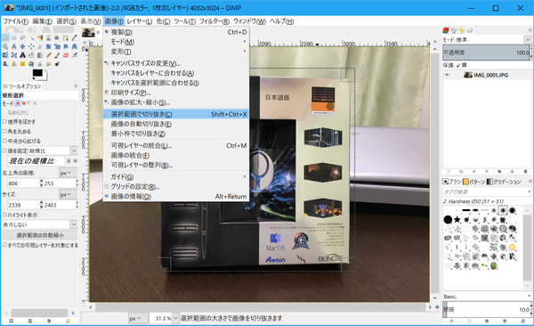
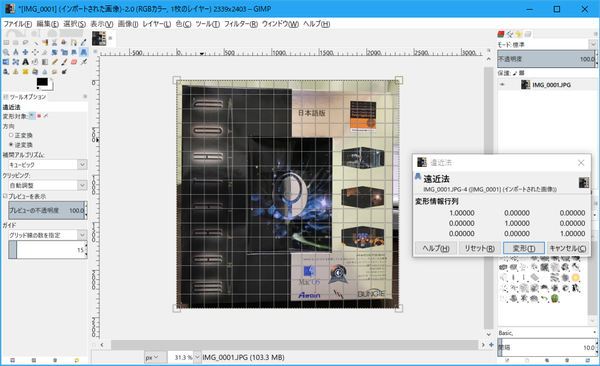

# 写真に撮った四角い物体の歪みをGIMPで補正する

2018-10-07作成

最近、いろいろなものを電子化しては、オリジナルを捨てている。むかし買ったパッケージソフトなんかもそのひとつだ。思い入れのあるものは、マニュアルやパッケージをスキャンして、PDFやJPEGにしてから捨てている。

マニュアルやパッケージがドキュメントスキャナで読み込めるものばかりなら問題はないが、A4を超える大きなものや、厚みがあるもの、あるいは硬くて曲がらないものなどは読み込めない。

そういう場合はフラットベッドスキャナでスキャンして、手動で角度補正してトリミングする。サイズが大きな紙などは、部分ごとにスキャンしてから合成し、1枚の画像にまとめることもある。ここまでやれば、まあほとんどのものは電子化できる。

しかし、それでもスキャンできないものもある。たとえば構造が立体的なものはそのひとつだ。うちの安いフラットベッドスキャナは被写界深度が浅いので、ガラス面から少し原稿が離れているだけで画像がぼやけてしまう。カセットテープのラベルなども、写るには写るが、くっきりした画像にはならない。

それでは、ということで、スマホのカメラで対象物を撮影してみると、強力な手ぶれ補正のおかげで画像はくっきりするが、今度は画像の歪みがでて、なかなかきれいな四角形にならない。しかし他に手段もないので、写真の歪みをうまく補正できないか調べてみたら、いつも画像の角度補正やトリミングに使っているGIMPであっさりとできてしまった。

前置きが長くなったが、カメラで撮った「四角いもの」の歪みと解像度をGIMPで調整する方法をメモしておく。なお、これを書いている時点でのGIMPの最新版は2.10系列だが、画像の角度を微調整すると解像感が下がってしまうようなので、ここではGIMP 2.8.22を使っている。

まず、対象を写真に撮る。ここでサンプルに使っている古(いにしえ)のゲームパッケージは、サイズが大きいうえに、真ん中に凝った立体構造があるため、フラットベッドスキャナではスキャンできない。

撮った写真をGIMPで開く。

「矩形選択」ツールを選択し、対象物の少し外側を囲む。

「画像」→「選択範囲で切り抜き」を選ぶと――、

さきほど囲んだ部分がトリミングされる。

「遠近法」ツールを選び、ツールオプションの「逆変換」を選んでから画像をクリックすると、このような状態になる。

画像の四隅の小さな□をドラッグして、切り取りたい対象物の範囲にあわせる。細かいところは画像を拡大してからやると良い。

「遠近法」ダイアログの「変形」ボタンを押すと、さきほど選択した範囲がきれいな長方形になる。

自分は、スキャナでスキャンしたデータの解像度は300dpiに統一しているので、カメラで撮ったこのデータも最終的に300dpiにしたい。そこで、「画像の拡大・縮小」を行う。

「画像の拡大・縮小」ダイアログが開くので、幅と高さのピクセル数を入力する。ピクセル数は、対象物の長さを実測し、1インチ(2.54cm)当たり300ピクセルになるように計算する。今回のサンプルは、幅も高さも25.4cm(つまり、ぴったり10インチ!)だったので、3000ピクセルになる。デフォルトでは縦横の比率が固定されているので、幅と高さを繋いでいる鎖の絵をクリックして、連動を切る。水平解像度と垂直解像度はどちらも300にする。

ダイアログの「拡大・縮小」ボタンを押すと、画像のサイズが変更される。

あとは、それをJPEGなどにエクスポートすれば――、

最終的にこのような画像になる。解像度が300dpiになっているので、スキャナでスキャンした画像と一緒にPDF化しても、サイズ比率が狂うこともない。

※バージョンメモ

- GIMP 2.8.22
