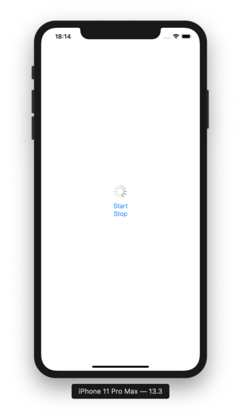
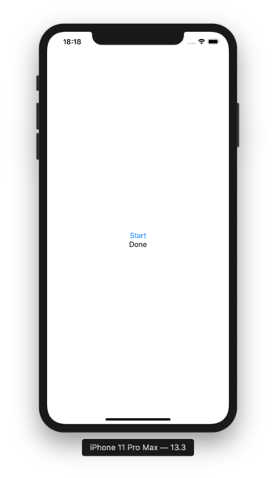
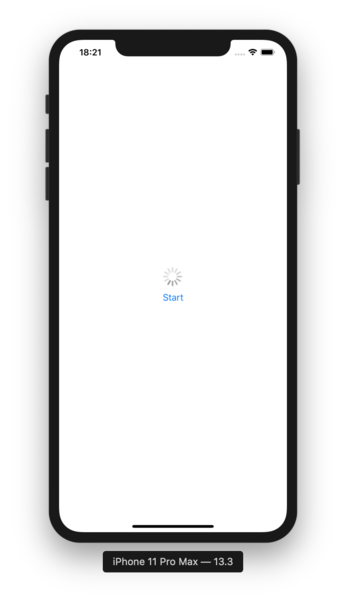

# SwiftUIでUIActivityIndicatorViewを使う

2020-02-22作成

SwiftUIで重い処理をしているとき、あのぐるぐる回る処理中マークを表示させたい。

けど、今のところSwiftUIにはActivityIndicatorが用意されていないので、UIActivityIndicatorViewをUIViewRepresentableでラップして使う。こんな感じの繋ぎ部品を作って――、

```swift
import SwiftUI

struct ActivityIndicator: UIViewRepresentable {
    @Binding var isAnimating: Bool

    let style: UIActivityIndicatorView.Style

    func makeUIView(context: Context) -> UIActivityIndicatorView {
        UIActivityIndicatorView(style: style)
    }

    func updateUIView(_ uiView: UIActivityIndicatorView, context: Context) {
        isAnimating ? uiView.startAnimating() : uiView.stopAnimating()
    }
}
```

Viewの中でActivityIndicatorと書けば使えるようになる。isAnimatingをBoolな@Stateに紐づけてやれば、ぐるぐるの表示/非表示を制御できる。

```swift
struct ContentView: View {
    @State var processing = false

    var body: some View {
        VStack {
            ActivityIndicator(isAnimating: $processing, style: .large)

            Button(action: { self.processing = true }) {
                Text("Start")
            }

            Button(action: { self.processing = false }) {
                Text("Stop")
            }
        }
    }
}
```

この例だと、Startを押したらぐるぐるが表示されて、Stopを押したら消える。



さて、ここまではあちこちに書かれてる簡単な話。

じゃあ、ここに重い処理を組み込んだらどうなるか。こんな感じでうまくいくのかと思いきや――、

```swift
struct ContentView: View {
    @State var processing = false
    @State var result = ""

    var body: some View {
        VStack {
            ActivityIndicator(isAnimating: $processing, style: .large)

            Button(action: {
                self.processing = true
                Thread.sleep(forTimeInterval: 3) // A heavy task
                self.result = "Done"
                self.processing = false
            }) {
                Text("Start")
            }

            Text(result)
        }
    }
}
```

これだとStartを押して3秒後にDoneと出るだけで、その間ぐるぐるは表示されない。Buttonのactionが全部終わるまで、画面が再描画されないんでしょうな、たぶん。



ならば重い処理を別スレッドで動かしてやればどうか。DispatchQueue.global().asyncの中に入れてみる。

```swift
struct ContentView: View {
    @State var processing = false
    @State var result = ""

    var body: some View {
        VStack {
            ActivityIndicator(isAnimating: $processing, style: .large)

            Button(action: {
                self.processing = true
                DispatchQueue.global().async {
                    Thread.sleep(forTimeInterval: 3) // A heavy task
                    self.result = "Done"
                    self.processing = false
                }
            }) {
                Text("Start")
            }

            Text(result)
        }
    }
}
```

お、これはうまくいった。Startを押すとぐるぐるが出て、3秒後にぐるぐるが消えてDoneが出た。いいね。




じゃあってんで、重い処理とその結果の表示をObservableObjectなViewModelに外出ししてみたところ――、

```swift
class ViewModel: ObservableObject {
    @Published var result = ""

    func process() {
        Thread.sleep(forTimeInterval: 3) // A heavy task
        self.result = "Done"
    }
}

struct ContentView: View {
    @State var processing = false
    @ObservedObject var viewModel = ViewModel()

    var body: some View {
        VStack {
            ActivityIndicator(isAnimating: $processing, style: .large)

            Button(action: {
                self.processing = true
                DispatchQueue.global().async {
                    self.viewModel.process()
                    self.processing = false
                }
            }) {
                Text("Start")
            }

            Text(viewModel.result)
        }
    }
}
```

実行時、resultに"Done"を設定した瞬間に、こんなエラーが出てしまった。ふーむ、@Publishedなプロパティを変更するときは、mainスレッドからじゃないとダメなのか。

```
2020-02-22 18:26:01.327981+0900 ActivityIndicatorViewSample[4278:277871] [SwiftUI] Publishing changes from background threads is not allowed; make sure to publish values from the main thread (via operators like receive(on:)) on model updates.
```

だからと言って、こんな感じに処理をDispatchQueue.main.asyncにすると、ぐるぐるは表示されない。やっぱりmainスレッドの処理がぜんぶ終わるまで画面が再描画されないんでしょうな。当たり前か。けど、これじゃあ元の木阿弥ですわ。

```swift
class ViewModel: ObservableObject {
    @Published var result = ""

    func process() {
        Thread.sleep(forTimeInterval: 3) // A heavy task
        self.result = "Done"
    }
}

struct ContentView: View {
    @State var processing = false
    @ObservedObject var viewModel = ViewModel()

    var body: some View {
        VStack {
            ActivityIndicator(isAnimating: $processing, style: .large)

            Button(action: {
                self.processing = true
                DispatchQueue.main.async {
                    self.viewModel.process()
                    self.processing = false
                }
            }) {
                Text("Start")
            }

            Text(viewModel.result)
        }
    }
}
```

実はここで諦めかけたんだけど、歯を磨いているときにハタと気づいた。

要するにViewにバインドされてる@Publishedな変数をいじる瞬間だけメインスレッドでやればいいんじゃなかろうか。というわけで、重い処理はDispatchQueue.global().asyncにいれつつ、画面の書き換えだけさらにDispatchQueue.main.asyncに入れてやったらうまく行きました。なお、ぐるぐるを消すタイミングもViewModel側で制御しなきゃいけない都合上、processingプロパティもViewModelに移してます。

```swift
class ViewModel: ObservableObject {
    @Published var processing = false
    @Published var result = ""

    func process() {
        Thread.sleep(forTimeInterval: 3) // A heavy task
        DispatchQueue.main.async {
            self.result = "Done"
            self.processing = false
        }
    }
}

struct ContentView: View {
    @ObservedObject var viewModel = ViewModel()

    var body: some View {
        VStack {
            ActivityIndicator(isAnimating: $viewModel.processing, style: .large)

            Button(action: {
                self.viewModel.processing = true
                DispatchQueue.global().async {
                    self.viewModel.process()
                }
            }) {
                Text("Start")
            }

            Text(viewModel.result)
        }
    }
}
```

SwiftもSwiftUIも詳しくないんでこれが正解かは知らないけど、ご参考までに。

※バージョンメモ

- macOS Catalina 10.15.3
- Xcode 11.3.1
