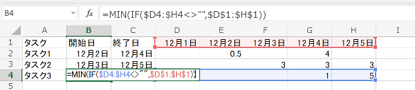

# Excelの予定表で開始日と終了日を自動表示する

2020-12-13作成

Excelでスケジュール表とかWBSを作るときに、各日付(ガントチャート)の部分に工数を割り振ってみて、それをもとに開始日と終了日は関数で自動表示したい、なんてことはよくあると思う。

昔はワーク行とかINDEX関数とかを駆使して頑張ってた気がするが、最近のExcelでは配列数式が使えるので、IFとMINとMAXだけで簡単にこれができる、ということに今頃ようやく気付いたので、メモ。

考え方としては、工数を割り振った範囲の中で入力があるセルについてだけ、いちばん上の行の日付に置き換えて、それのMINを取れば開始日に、MAXを取れば終了日になる。入力の無いセルはIFの結果がFALSEになるので、MINやMAXは無視してくれるというわけだ。この「工数を割り振った範囲の中で入力があるセルについてだけ」という部分がひと昔前は厄介だったが、最近のExcelなら「=IF(D4:H4<>"",……)」と書くだけでD4:H4の範囲を自動でぐるぐる回してカラのセルかどうか判定してくれて、IFの第2引数に「D1:H1」と書くだけで、第1引数がTRUEになったセルについて、対応する列の1行目のセルの値に置き換えてくれる。これはなかなか便利で分かりやすい。

ちなみにLibre Office Calcでも同じことはできるが、式を編集したあとは、Excelと違って必ずCtrl+Shift+Enterを押す必要がある。うっかりEnterだけを押してしまうと、#VALUE!のエラーになる。この場合は、式のどこかを書き換えてもういちどCtrl+Shift+Enterを押せば復活する。

※バージョンメモ

- Microsoft 365
- LibreOffice 7.0.3
